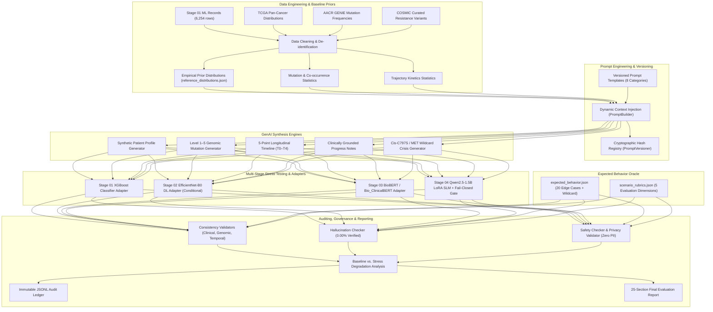

# STAGE 05 — SYSTEM ARCHITECTURE

## 1. Architectural Overview
The Stage 05 Generative AI subsystem is designed as an autonomous, modular, auditable, and scientifically rigorous synthetic oncology scenario generation and multi-stage stress-testing platform.

## 2. Engineering Role Separation
1. **Data Engineer**: Ingests, sanitizes, and computes parametric and non-parametric statistical distributions.
2. **EDA & Prompt Engineer**: Generates visual distributions and version-controlled prompt registries.
3. **GenAI Engineer**: Synthesizes multi-timepoint trajectories, rare genomic co-mutations, and progress notes.
4. **Evaluation Engineer**: Benchmarks upstream models across 20 edge cases and calculates robustness degradation.
5. **Integration Engineer**: Bridges Stages 01–04 via strict, non-destructive contracts.
