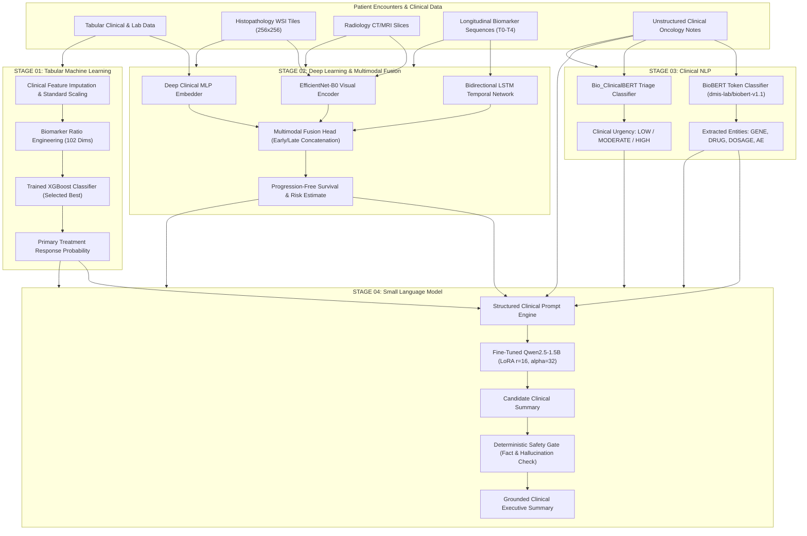

# End-to-End System Architecture

## 1. High-Level Multimodal Flow

---

## 2. Stage Contracts & Inter-Module Interfaces

| Stage | Input Contract | Output Contract | Verification Mechanism |
| :--- | :--- | :--- | :--- |
| **Stage 01** | Tabular patient encounter dictionary (64 raw features) | Response probability float `[0.0, 1.0]`, feature importance map | `STAGE_01_ML/SCRIPTS/verify_stage_01.py` |
| **Stage 02** | Multi-channel tensors (image 3x256x256, sequence 5x8, tabular 102) | Combined multimodal risk score, Grad-CAM attention heatmap | `STAGE_02_DL/SCRIPTS/verify_stage_02.py` |
| **Stage 03** | Free-text clinical oncology notes (`str`) | Structured entity list (`List[Dict]`), Urgency level (`str`) | `pytest STAGE_03_NLP/nlp_engineer/tests` |
| **Stage 04** | Formatted instruction prompt with patient context | Verified clinical summary (`str`), hallucination flag (`bool`) | `pytest STAGE_04_SLM/tests` |
